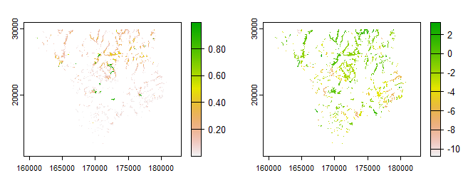
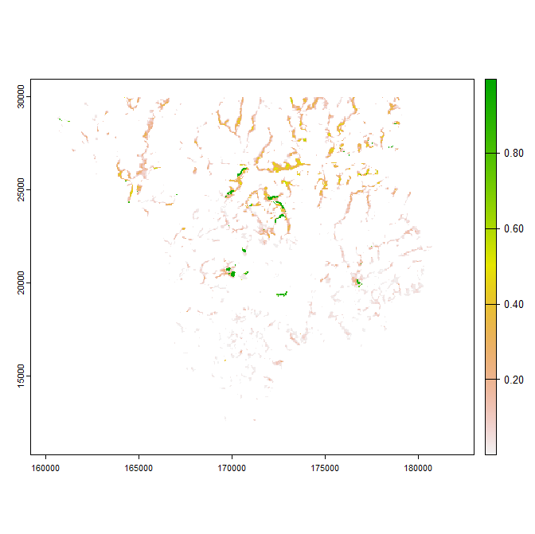
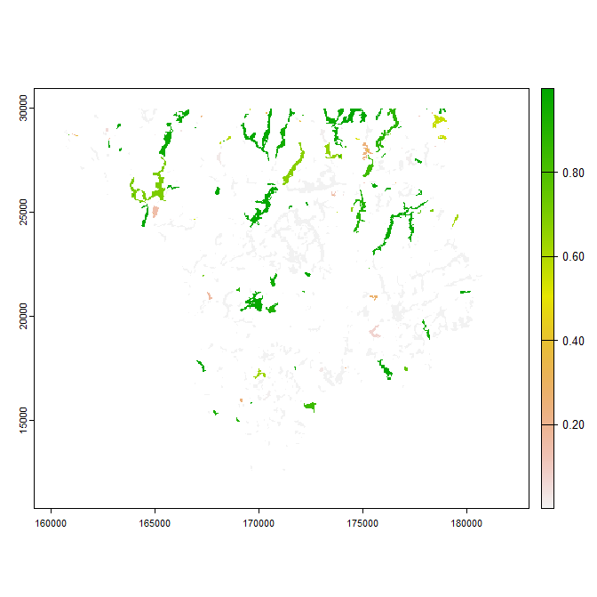
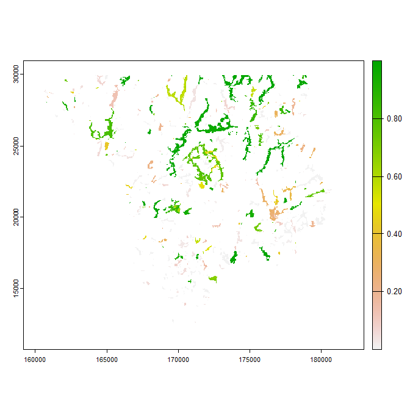
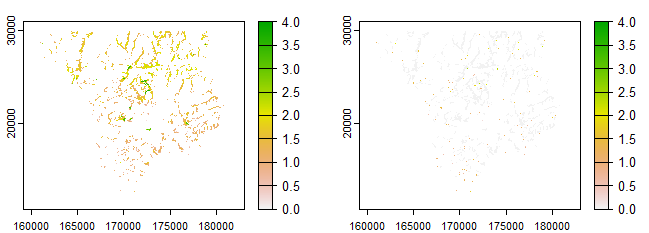
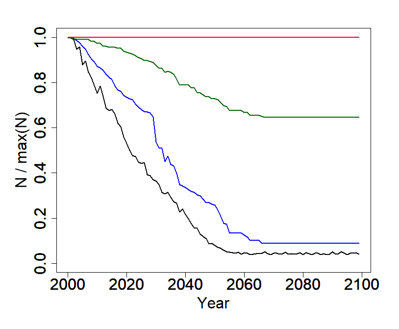
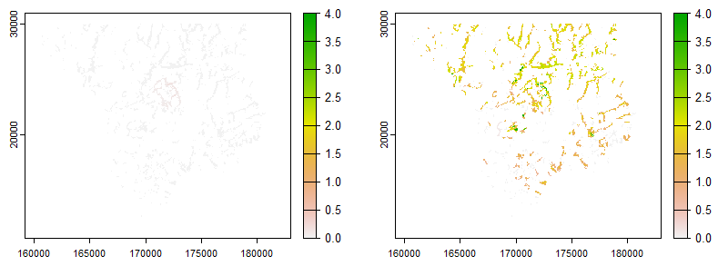
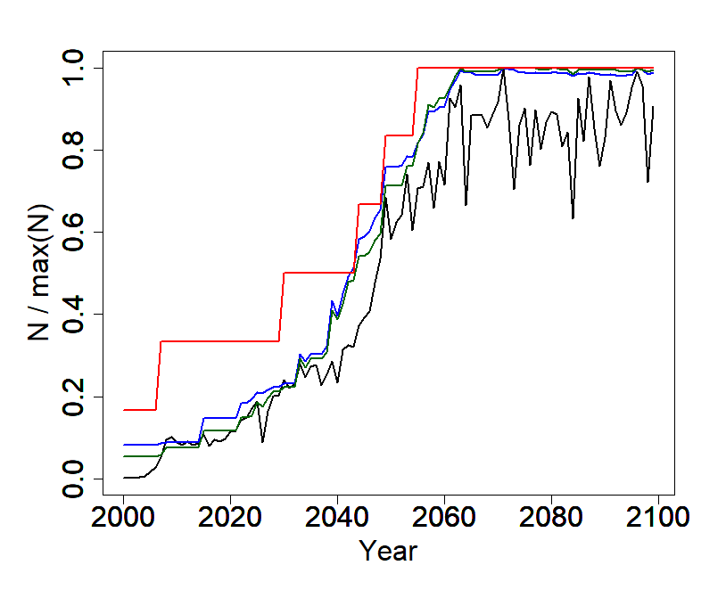
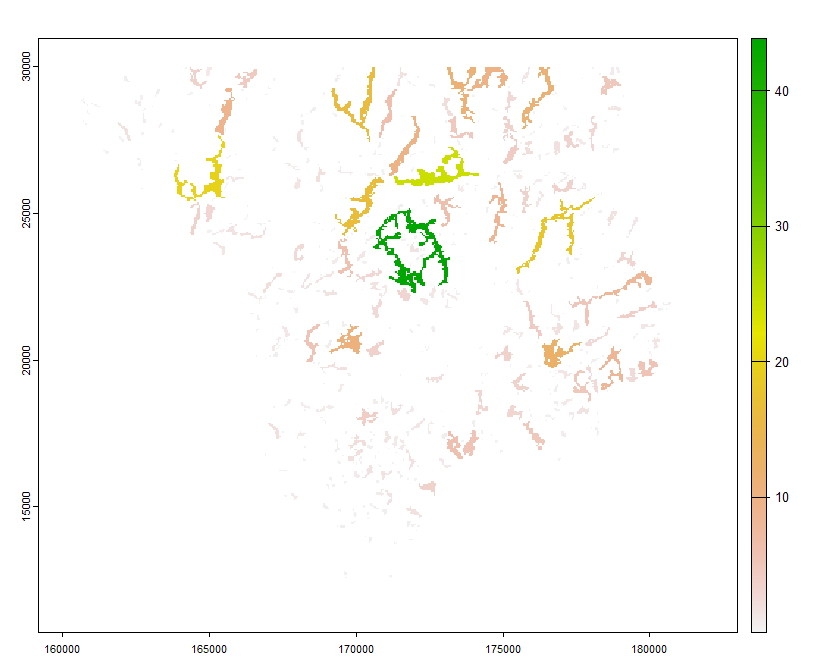
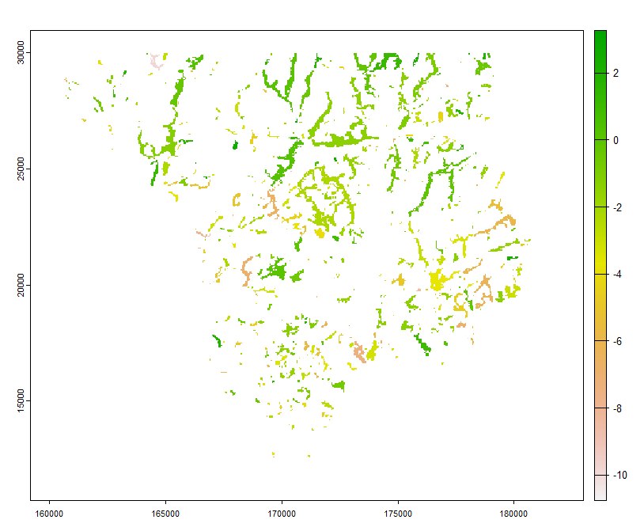

```{r, include = FALSE}
knitr::opts_chunk$set(
  collapse = TRUE,
  comment = "#>"
)
```
<style>
  body {
    text-align: justify;
  }
  
  .col2 {
    columns: 2 200px;         /* number of columns and width in pixels */
    -webkit-columns: 2 200px; /* chrome, safari */
    -moz-columns: 2 200px;    /* firefox */
  }
  
  .leg {
    font-size: 12px;
  }

  img {
    display: block;
    margin-left: auto;
    margin-right: auto;
    max-width: 100%;
    height: auto;
  }

  .figure {
    text-align: center;
    margin: 20px 0;
  }

  .figure img {
    display: inline-block;
    vertical-align: middle;
  }

  .figure figcaption {
    font-size: 12px;
    text-align: center;
  }
</style>
* [Overview](#overview)
* [The metapopulation model](#the-metapopulation-model)
  + [The metapopulation model explained](#the-metapopulation-model-explained)
  + [Fitting a metapopulation model](#fitting-a-metapopulation-model)
  + [The hybrid model explained](#the-hybrid-model-explained)
  + [Fitting a hybrid model](#fitting-a-hybrid-model)
* [The spatial demographic model](#the-spatial-demographic-model)
  + [The spatial demographic model explained](#the-spatial-demographic-model-explained)
  + [Simulating population demographics spatially](#simulating-population-demographics-spatially)
* [Useful functions for calculating patch metrics](#useful-functions-for-calculating-patch-metrics)

## Overview
This vignette describes the R package ‘PopScape’, a versatile open-source framework 
that can be used to run, visualize and interact with spatial population models, A 
key attraction of PopScape is that it is highly optimized for computational performance.
The package itself comprises a series of R wrapper functions, but most of the underlying
computations are done using C++. This helps to overcome traditional parameterization 
challenges. It is possible visualize the effects of changing parameters very quickly, 
meaning that it is feasible to repeatedly sample from parameter space and compare multiple predictions to observations in a manner akin to fitting statistical models. To get started install and load the package as follows:

```{r eval=FALSE}
require(devtools)
devtools::install_github("ilyamaclean/PopScape")
library(PopScape)
```

### The metapopulation model
Metapopulation dynamics in `PopScape` are handled using the Incident Function Model (IFM). 
The IFM is a widely used framework for modeling metapopulations—populations distributed across discrete habitat patches connected by dispersal. The model focuses on the dynamics of patch occupancy, describing the processes of colonization and extinction in a system of habitat patches.

The IFM assumes that the probability of colonization for a given patch depends on its connectivity to other occupied patches, weighted by their sizes and distances. Similarly, the extinction probability depends on the patch’s characteristics, such as its size or quality. 

Traditionally, to parameterize an IFM, because the probability of colonization is contingent on the occupancy of surrounding patches, one requires complete, or near-complete snapshots of
occupancy in one or more timesteps. One must also delineate the patches *a priori*, and if accounting for variation in their quality, devise some means of relating features of the the 
patches to potential population density so that carrying-capacity can be defined. `PopScape`
leverages the capability of a species distribution model (SDM) to predict the population
density in patches and determine whether or not they are occupied. The package contains functions for fitting both tradiational and hybrid models and for simulating metapopulation
dynamics quickly in real landscapes.

### The metapopulation model explained
In a traditional basic Incident Function Model the incidence $\small J_i$, or probability 
that any habitat patch $\small i$ is occupied at any given time is given by:

$$J_i=\frac{C_i}{C_i+E_i-C_iE_i}$$
where $\small C_i$ is the probability that the patch will be colonized from surrounding 
occupied patches within a time-step, $\small E_i$ is the extinction probability during
that timestep and $\small CiEi$ is a 'rescue effect`, meaning that if within a time-step
the population goes extinct, it can be recolonized from adjacent patches.

The extinction probability $\small E_i$ of an occupied patch $\small i$ is given by:

$$E_i=\frac{\mu}{A^x}$$

where $\small \mu$ is the extinction probability of a patch of unit size and $\small x$ 
determines the scaling of extinction risk with patch area $\small A$.

The colonization probability $\small C_i$ is given by:

$$C_i=\frac{{M_i}^2}{{M_i}^2+y^2}$$
where $\small M_i$ is the the number of immigrants and $\small y$ determines how fast the colonization probability approaches unity with increasing $\small M_i$. For practical 
purposes when seeking to parameterize the model, $\small M_i$ is defined as $\small M_i=\beta S_i$ where $\small S_i$ is a measure of connectivity. The constant $\small \beta$ is generally unknown and the product of several components, including the density of individuals in the patches, the fraction if individuals leaving their natal patch and the fraction of emigrants moving from patch $\small j$ in the direction of patch $\small i$. Colonization probability can then be expressed in terms of connectivity as:

$$C_i=\frac{{S_i}^2}{{S_i}^2+\gamma}$$
where $\small \gamma=y^2/\beta^2$ and $\small S_i$ is connectivity given by:

$$S_i=A_i\sum_{i\neq j}O_jD_{ij}A_j$$
where $\small O_j=1$ denotes patches that are occupied, $\small A$ is patch area (of either patch $\small i$ or $\small j$). Here $\small D_{ij}$ describes the distribution of dispersal distances and is given by:

$$D_{ij}=\exp(-\alpha d_{ij})$$
where $\small 1/\alpha$ is the average dispersal distance and $\small d_{ij}$ the distance between patch $\small i$ and $\small j$.

### Fitting a metapopulation model
If $\small S_i$ is calculated explicitly, the IFM can be fitted using a standard logistic regression. 

The procedure is as follows:

$$J_i=\frac{C_i}{C_i+E_i-C_iE_i}=[\frac{1+\mu\gamma}{{S_i}^2{A_i}^x}]^{-1}=\frac{1}{1+\exp(\ln\mu\gamma-2\ln S_i-x\ln A_i)}$$
Thus:

$$\ln\frac{J_i}{1-J_i}=-\ln\mu\gamma+2\ln S_i+x\ln A_i$$
which can be modeled using standard logistic regression with $\small S_i$ included as an offset. The slope of the regression then becomes $\small x$ and the constant $\small \ln\mu\gamma$. To separate $\small \mu$ and $\small \gamma$ one can assume that that the smallest plot where the species is present is of the size where extinction probability is 1.
Thus $\small \mu/{A_{min}}^x=1\implies\mu={A_{min}}^x\implies\gamma=\mu\gamma/\mu$

The inclusion of $\small S_i$ as an offset in turn necessitates that $\small \alpha$ is known or can be estimated. In the function `fitmetapop` this is handled by providing plausible limits for $\small \alpha$ and the value leading to the best model fit is derived by iteration. However, in so doing, a number of well-fitting models can be obtained with near equal likelihood, and often the $\small \gamma$ parameter compensates for ill-chosen values of
$\small \alpha$. It is best, therefore to think carefully about the average dispersal
distance and choose values sensibly. 


In example below, the inbuilt example dataset `metapopdata` is provided to the function and alpha ($\small km^{-1}$) is held fixed at 10 (the same value used for simulating the dataset). This is achieved simply by setting both `alphamin` and `alphamax` to 10. The `metapopdata` dataset is a data.frame comprising columns `x` and `y` - the coordinates (in meters using the British National Grid system) for each patch, `pa` giving presences (1) and absences (0) and `Area` giving the area of each patch in Ha.

```{r eval=FALSE}
params<-fitmetapop(metapopdata, alphamin = 10, alphamax = 10)
params
```

Despite only containing presences for 31 habitat patches the derived parameters are 
pretty close to their original values of $\small \mu=0.01$, $\small x=3$ and $\small \gamma=1$.

### The hybrid model explained
The inconvenience of fitting a metapopulation model is that patch occupancy must be known
in all patches prior to doing so. The hybrid approached adopted in 'PopSim' has several key differences.

First, it is assumed that known presences and absences are sub-sample of all actual presences
and absences across a landscape and that one does not necessarily know exactly constitutes a habitat patch. Rather land cover or habitat type is assumed to be a primary determinant of what constitutes a habitat and habitat patches are instead automatically delineated and their areas calculated by assuming that any habitat or land cover class that contains a 'presence' record is potentially suitable. Second, however, it is assumed that population density is not necessarily identical across a habitat patch and that instead, other environmental variables
also affect density. 

The extinction probability $\small E_i$ of an occupied patch $\small i$ is given by:

$$E_i=\frac{\mu}{(qA)^x}$$

where $\small \mu$ is becomes extinction probability of a patch of unit carrying capacity $\small qA$ and $\small x$ now determines the scaling of extinction risk with patch carrying capacity and $\small q$ is the quality of the habitat patch defined in terms of maximum potential density of individuals.  

Connectivity $\small S_i$ is then given by:

$$S_i=q_iA_i\sum_{i\neq j}O_jD_{ij}q_jA_j$$
and the distance between patches $\small d_{ij}$ scaled to accommodate varying $\small q$ across each patch. This is achieved using a raster layer of derived habitat suitability that scales with  $\small q$ and calculating the mean Euclidian distance from each pixel in focal patch $\small i$ to each pixel in patch $\small j$, weighting the distance by the suitability of the pixel in patch $\small j$. Habitat suitability is itself derived from the environmental datasets passed to the fitting function, which in turn estimates $\small q$ from the logit transform of predicted probability of occurrence $\small p$ as follows:

$$q=(\ln\frac{p}{1-p})^n, q\geq t_h,\space\space q=0, q<t_h$$
where $\small n$ scales the logit transform of probability of occurrence to density and is founded on the well-demonstrating scaling relationships between abundance and occupancy and $\small t_h$ is a threshold suitability value below which density is assumed to be zero. Because $\small q$ represents potential rather than actual densities, $\small p$ is calculated from environmental suitability alone, without considering connectivity to adjacent patches. It therefore has a slightly different conceptual meaning to $J_i$ and is best defined as a potential probability of occurrence, given underlying environmental conditions.

In the code below, the inbuilt `habsuit` function is based to the `calcconectivity` function, which calculates the degree of connectivity of each patch to surrounding focal patches and returns a SpatRaster

```{r eval=FALSE}
Oj <- rep(1, 506) # code below delinates 506 patches. Here all assumed occupied.
# Convert habsuit layer (representing potential densites to p)
p <- 1 / (1 + exp(-rast(habsuit)^0.1)) 
S <- calcconectivity(p, thresh = 0.5, alpha = 10, aos = 0.1, minden = 0.01,
                            maxden = 20, Oj)
par(mfrow = c(1, 2))
plot(rast(habsuit))
plot(log(S))
```

The final hurdle to overcome is that $\small O_j$ is incompletely known if available data represent only a sub-sample of actual presences and absences. To circumvent the issue, an iterative process is used in which the model is initially seeded with occupancies proportional to the prevalence of occurrences in available data a model is then fitted and used to predict occupancies. These predicted occupancies are then used in place of observed $\small O_j$ and the model re-fitted until convergence. We demonstrate this workflow below, which also showcases the inbuilt function for running a stochastic patch occupancy model with known parameters.

### Fitting a hybrid model
To demonstrate how the hybrid model is fitted, we first run a stochastic metapopulation model simulation with known parameters using the `MetaPopSim` function. We first create a habitat suitability layer representing $\small p$ from the inbuilt landcover and vegetation height datasets.

```{r eval=FALSE}
lcover <- rast(landcover)
vhgt <- rast(veghgt)
broadwood <- conifwood <- lcover * 0
broadwood[lcover == 1] <- 1
conifwood[lcover == 2] <- 1
msk <- 0.5 * (broadwood + conifwood)
msk[msk == 0] <- NA
lhabsuit <- 5.2 * conifwood + 0.1 * broadwood + 2 * log(vhgt) - 5.2
hsuit <- mask(1 / (1 + exp(-lhabsuit)), msk)
plot(hsuit)
```

We then run the metapopulation simulation over 500 time-steps as follows specifying to return a probabilistic rather than binary output in the format of a SpatRaster

```{r eval=FALSE}
occo <- MetaPopSim(hsuit, mu = 0.01, x = 0.2, alpha = 10, ygamma = 2, aos = 0.1, 
                   timesteps = 500, minden = 0.01, maxden = 20, asprob = TRUE)
plot(occo)
```


As the underlying simulation is performed in C++ it runs in less than 2 seconds, even though there is quite a lot going on under the hood: 506 habitat patches are delineated and their carrying capacities calculated, the connectivities are scaled by habitat suitability and the model is then run stochastically over 500 time-steps. You can see that occupancy is near-certain in some of the larger, well-connected patches, whereas some of the environmentally suitable patches are assumed to become unoccopied.

From the outputs of this simulated dataset of occurence probabilities, we then use the inbuilt function `subsample` to derive a dataset of occourances of the type ne might typically have when seeking to fit a hybrid model. The 'landcover' dataset is past to the function so that absences can also be sensibly derived from potentially suitable habitat.

```{r eval=FALSE}
occdata <- subsample(occo, rast(landcover), n = 500)
head(occdata)
```

The fitting procedure with the `fitmetapopsdm` works much more reliably if `alpha` and `aos` are known, so these are provided as inputs to the model rather than estimated. Users may wish to explore the implications of applying different values, but using `fitmetapopsdm` function
to derive parameters and the the `MetaPopSim` to model how these parameters influence prodicted occurrence. 

```{r eval=FALSE}
fitted <- fitmetapopsdm(occdata, rast(landcover), conpredictors = log(rast(veghgt)), 
  alpha = 10, aos = 0.1)
params <- fitted$params
pocco <- fitted$pocco
params
pocco[is.na(pocco)] <- 0
pocco <- mask(pocco, rast(landcover))
plot(pocco)
```

Inevitably, the parameters don't match perfectly, but the predicted occurrence versus that originally used to derive the subsample of data are not hugely different.

## The spatial demographic model
In addition to the metapopulation, `PopScape` also contains an inbuilt spatial demographic model for simulation populaion dynamics across landscapes. Below we explain the model.

### The spatial demographic model explained
The spatial population models runs on habitat patches, and each habitat patch is assumed to 
comprise a discrete population. Within each time-step, individuals are assumed to emigrate from or immigrate to other patches.

In each patch, the population $\small N_{t+1}$ at time $\small t+1$ is determined from the population $\small N_T$ in the previous time-step $t$ as follows: 

$$N_{t+1}=rN_t(1-\frac{N_t}{K_t})-E+I$$
where $\small r=b_rs_r$ is the intrinsic rate of population growth determined from the the birth rate $\small b_r$ and survival rate $\small s_r$, $\small K_t$ is the carrying capacity at time $\small t$, $\small E$ the number of emigrants and $\small I$ the number of immigrants.
By default, the model is run stochastically, and $\small rN_t$ is calculated as `sum(rpois(Nt, r))`.

After accounting for births and deaths, the number of individuals emigrating is determined from a user specified emigration fraction $\small f_e$ such that

$$E=f_erN_t(1-\frac{N_t}{K_t})$$
The number of immigrants arriving at a focal patch $\small i$ is contingent on the summed total of individuals emigrating from other patch $\small j$ such that

$$I_i=\sum_{i\neq j}E_jf_s\small D_{ij}f_i$$
where $\small f_s$ is the survival rate of emigrants, $\small D_{ij}=\exp(-\alpha d_{ij})$ is the probability that a dispersing individual is capable of dispersing over distance $\small d_{ij}$ given a mean dispersal distance of $\small 1/\alpha$ and $f_i$ is the fraction of individuals dispersing to distance $\small d_{ij}$ that are intercepted by the patch, approximated by

$$f_i\approx\frac{\sqrt A_i}{2\pi d_{ij}}$$

### Simulating population demographics spatially
Simulations are performed using the `PopDynamicsSim` function, which takes the following as inputs: 

* `popden` - a multi-layer SpaRaster of maximum potential population densities in each time-step.
* `birthrate` - a multi-layer SpaRaster of number of births as a function of environmental
suitability within each time-step.
* `survival` - a multi-layer SpaRaster of survival rates as a function of environmental
suitability within each time-step.
* `avdispdist` - average dispersal distance (in km if units of raster layers are meters).
* `fracdisp` - fraction of population emigrating from each population between time-steps
* `em_surv` - fraction of emigrants that typically survive.
* `Nt` - optionally, a single layer SpatRaster of the initial population size associated with each habitat patch. If not provided, patches are assumed initially to be at carrying capacity.

In the example below, we use the `PopDynamicsSim` to explore several issues associated with the concept of extinction debt - namely the delayed response of a population to any changes in habitat quality. We first generate some simulated maximum potential population densities, birthrates and survival rates over 100 years, with all three assumed to vary by habitat quality. These are also assumed to vary stochastically across years. Crucially the surival rate is set such that the number of deaths marginally exceeds the numbers of births on average such that the population is in decline, but non of the variables exhibit an overall trend. We first generate the input datasets and simulate population dynamics. The function returns a multi-layer SpatRaster of the population size in each pixel of the SpatRaster in each time-step (i.e. population density in each time-step). Population density The first and last time-step are plotted.

```{r eval=FALSE}
# ~~~~~~~~~~~~~~~~ Popoulation similation example ~~~~~~~~~~~~~~~~~~~~~~~~~~~ #
# Create stacked SpatRaster of population density
popden <- (rast(habsuit) * 0.35) * 
   exp(rnorm(100, 0, 0.1))
# Simulate stacked SpatRaster of birth rates
birthrate <- (rast(habsuit) * 0.2 + 2) *
  exp(rnorm(100, 0, 0.1))
survival <- 0.9 / ((rast(habsuit) * 0.2 + 2) *
  exp(rnorm(100, 0, 0.1)))
pops <- PopDynamicsSim(popden, birthrate, survival,  avdispdist = 20, fracdisp = 0.1, emmsurv = 0.95)
par(mfrow = c(1, 2))
plot(pops[[1]], range = c(0, 4))
plot(pops[[100]], range = c(0, 4))
```

Next we use a convenient inbuilt function `apply3Dv`, which is essentially an R wrapper of a c++ function that is used to derive a total count in each time-step across the study area. It is equivalent to the R function `apply(my3Darray, 3, sum, na.rm = TRUE)`, but is quicker. We then derive occupancy at different spatial resolutions and plot how these change over time.

```{r eval=FALSE}
# ~~~~~~~~~~~~~~~~~~~~ Calculate total population ~~~~~~~~~~~~~~~~~~~~~~~~~~~ # 
N <- apply3Dv(as.array(pops))
# ~~~~~~~~~~~~~~~~~~~~ Calculate occupancy and different scales ~~~~~~~~~~~~~ # 
occ100m <- aggregate(pops, 2, fun = "sum", na.rm = TRUE)
occ100m[occ100m > 0] <- 1
occ1km <- aggregate(occ100m, 10, fun = "sum", na.rm = TRUE)
occ1km[occ1km > 0] <- 1
occ10km <- aggregate(occ1km, 10, fun = "sum", na.rm = TRUE)
occ10km[occ10km > 0] <- 1
occ100m <- apply3Dv(as.array(occ100m))
occ1km <- apply3Dv(as.array(occ1km))
occ10km <- apply3Dv(as.array(occ10km))
# ~~~~~~~~~~~~~~~~~~~~~~~~~~~~~~~ Plot normalised trends ~~~~~~~~~~~~~~~~~~~~ # 
year <- c(2000:2099)
par(mar=c(6, 6, 3, 3))
plot((N/max(N)) ~ year, type = "l", lwd = 2, xlab = "Year", ylab = "N / max(N)",
     cex.axis = 2, cex.lab = 2, ylim = c(0, 1))
par(new = TRUE)
plot((occ100m/max(occ100m)) ~ year, type = "l", lwd = 2, xlab = "", ylab = "",
     cex.axis = 2, cex.lab = 2, col = "blue", ylim = c(0, 1))
par(new = TRUE)
plot((occ1km/max(occ1km)) ~ year, type = "l", lwd = 2, xlab = "", ylab = "",
     cex.axis = 2, cex.lab = 2, col = "darkgreen", ylim = c(0, 1))
par(new = TRUE)
plot((occ10km/max(occ10km)) ~ year, type = "l", lwd = 2, xlab = "", ylab = "",
     cex.axis = 2, cex.lab = 2, col = "red", ylim = c(0, 1))
```

It can be seen that the total population size decays approximately exponentially, as would be expected given the functional form of the population equation. However, there is a period just prior to 2035 in this simulated example, where the population declines more rapidly when metapopulations collapse. Note that because the input datasets are randomly and population dynamics themselves are modeled stochastically, each model run will yield a slightly different result from that above. Eventually, the population is confined to just a small number of the highest quality patches.  

A marked difference is evident in the occupancy trends, with the differences most marked at coarser grid resolutions. This is because ti takes just one individual for a grid cell to be deemed occupied, whereas all individuals must go extinct from a grid cell before it is deemed empty. The take-homes form this simulation are (i) it takes time for declining populations to be extirpated, (ii) trends assessed using occupancy may mask much of the decline and (iii) the overall trends are often non-linear marked by more sudden declines when metapopulations collapse.

We next model the converse situation in which we imagine the area has become newly suitable and the landscape is seeded with just one small population, with crucial difference that in this example, births are assumed to exceed deaths. WE also allow the species to have sligthly better dispersal ability

```{r eval=FALSE}
popden <- (rast(habsuit) * 0.35) * 
   exp(rnorm(100, 0, 0.1))
# Simulate stacked SpatRaster of birth rates
birthrate <- (rast(habsuit) * 0.2 + 2) *
  exp(rnorm(100, 0, 0.1))
survival <- 2 / ((rast(habsuit) * 0.2 + 2) *
  exp(rnorm(100, 0, 0.1)))
patch<- patches(popden[[1]] * 0 + 1, directions = 8)
# Seed one patch with 5 individuals
Nt <- patch * 0
Nt[patch == 228] <- 5
pops <- PopDynamicsSim(popden, birthrate, survival,  avdispdist = 20, fracdisp = 0.1, emmsurv = 0.95, Nt = Nt)
par(mfrow = c(1, 2))
plot(pops[[1]], range = c(0, 4))
plot(pops[[100]], range = c(0, 4))
```

You can see here that the population has expanded from its =initial example, In the next example. We can then check how these paterns manifest in terms of abundance and occupancy trends


```{r eval=FALSE}
# ~~~~~~~~~~~~~~~~~~~~ Calculate total population ~~~~~~~~~~~~~~~~~~~~~~~~~~~ # 
N <- apply3Dv(as.array(pops))
# ~~~~~~~~~~~~~~~~~~~~ Calculate occupancy and different scales ~~~~~~~~~~~~~ # 
occ100m <- aggregate(pops, 2, fun = "sum", na.rm = TRUE)
occ100m[occ100m > 0] <- 1
occ1km <- aggregate(occ100m, 10, fun = "sum", na.rm = TRUE)
occ1km[occ1km > 0] <- 1
occ10km <- aggregate(occ1km, 10, fun = "sum", na.rm = TRUE)
occ10km[occ10km > 0] <- 1
occ100m <- apply3Dv(as.array(occ100m))
occ1km <- apply3Dv(as.array(occ1km))
occ10km <- apply3Dv(as.array(occ10km))
# ~~~~~~~~~~~~~~~~~~~~~~~~~~~~~~~ Plot normalised trends ~~~~~~~~~~~~~~~~~~~~ # 
year <- c(2000:2099)
par(mar=c(6, 6, 3, 3), mfrow = c(1, 1))
plot((N/max(N)) ~ year, type = "l", lwd = 2, xlab = "Year", ylab = "N / max(N)",
     cex.axis = 2, cex.lab = 2, ylim = c(0, 1))
par(new = TRUE)
plot((occ100m/max(occ100m)) ~ year, type = "l", lwd = 2, xlab = "", ylab = "",
     cex.axis = 2, cex.lab = 2, col = "blue", ylim = c(0, 1))
par(new = TRUE)
plot((occ1km/max(occ1km)) ~ year, type = "l", lwd = 2, xlab = "", ylab = "",
     cex.axis = 2, cex.lab = 2, col = "darkgreen", ylim = c(0, 1))
par(new = TRUE)
plot((occ10km/max(occ10km)) ~ year, type = "l", lwd = 2, xlab = "", ylab = "",
     cex.axis = 2, cex.lab = 2, col = "red", ylim = c(0, 1))
```

What we notice form this example is that the occupancy trends tend to to mirror the abundance trends fairly well. The take home message from this simulated example was really to illustrate problems with inferring biodiversity change from fairly coarse-resolution occupancy data as cis commonly the case in e.g. the UK State of Nature Report. The way that population dynamics play out, declines are typically masked, whereas increases are tracked fairly well. Rather worryingly, this is implies that the UK's biodiversity is in potentially in a more perilous state than is commonly reported.

## Useful functions for calculating patch metrics
Lastly, some of the other functions included with the `PopScape` package are briefly showcased. Here we show how patch area and measures of connectivity can be calculated.

Patch area is calculated using the `calcarea` function. The function has three inputs.  First a SpatRaster of potentially suitable habitat with non-suitable areas masked out at NAs. Second, a threshold used to decide whether habitat is suitable or not - any values below the value specified by `thresh` are assumed unsuitable. By default the threshold is set to zero. Lastly, and optional logical `asraster` indicating whether to return a SpatRaster layer (TRUE) or a vector listing the size of each patch (default TRUE). Returned values are the number of pixels associated with any given patch rather than arfeas in some unit of measurement. We show how these can be converted to e.g. hectares.

```{r eval=FALSE}
area <- calcarea(rast(habsuit)) # in pixels
areaHa <- area * (res(area)[1]^2) / 100^2
plot(areaHa)
```

There is also an option to calculate patch connectivity to surrounding patches using the `calcconectivity` function. As previously, the function takes a SpatRaster of potentially suitable habitat with non-suitable areas masked out at NAs as an input. Again `thresh` is used to decide whether habitat is suitable or not - any values below the threshold are assumed unsuitable. A value `alpha` specifies the inverse average dispersal distance (km) and  
because connectivity is weighted by potential patch density, a parameter `aos` is used - the effective scaling coefficient between the logit transform of `habsuit`. If `habsuit` have values that extend beyond zero and one, they are normalised to lie within this range. Setting `aos` to zero makes density constant. To avoid unnaturally high and low densities as normalised `habsuit` tends to zero or 1, limits are defined using `minden` and `maxden`. Optionally, the user can specify a vector of 1s and zeros, Specifying which patches are occupied. By default this is set to NA, meaning that all patches are assumed occupied. Finally, as with `calcarea`, there is the option to specify whether or not to return patch connectivity as a SpatRaster.

Below we run  `calcconectivity` using default settings with the inbuilt `habsuit` dataset and  plot the results (logged).

```{r eval=FALSE}
Sr <- calcconectivity(rast(habsuit))
plot(log(Sr))
```


A final useful function is `extractpatchmetrics`, which as the name suggests, which takes as an input a data.frame of occurrence data with x and y coordinates, a landcover or habitat class dataset, and any number of continuous predictors stacked together into a multi-layer SpatRaster. Patch area and connectivity are automatically calculated using the functions demonstrated above.

```{r eval=FALSE}
occdata <- data.frame(x = metapopdata$x, y = metapopdata$y, pa = metapopdata$pa)
lveghgt <- log(rast(veghgt))
names(lveghgt) <- "logveghgt"
occdata <- extractpatchmetrics(occdata, rast(landcover), lveghgt)
head(occdata)
```
